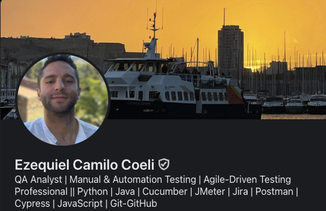

# console.log("¡Hola GitHub!") 
Soy Ezequiel, un fan de las computadoras desde siempre y de la tecnología en general.

Desde el 2021 trabajo como QA participando en múltiples proyectos internacionales lo que me dió, junto con mi formación, un entendimiento claro y experiencia en ciclos de desarrollo de software y trabajo con equipos de todo el mundo.

A inicios del 2025 empecé a dar mis primeros pasos en el mundo de la programación, principalmente en desarrollo web pero también de aplicaciones multiplataforma y desarrollo de vidoejuegos con Godot Engine.

## Proyectos
- 🌐 **[Portfolio](https://ezecoeli.github.io/React-Portfolio/)**  
  Mi portfolio donde muestro las aplicaciones web desarrolladas por mi con React (JavaScript).

- 🎮 **[Aura Mortis](https://github.com/ezecoeli/Aura-Mortis)**  
  Videojuego en desarrollo creado con **Godot 4**.  
  
- Comparto el desarrollo de un proyecto flutter multiplataforma.

**Sígueme en:**  
[LinkedIn](https://www.linkedin.com/in/ezequiel-coeli-softwareqadev/) 
