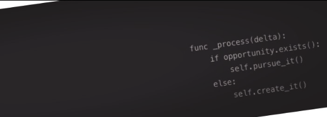

# ¡Hola Comunidad! 
Soy Ezequiel, un apasionado por la tecnología en constante aprendizaje. 

Hace más de tres años trabajo como QA tester y estoy dando mis primeros pasos en el mundo de la programación.

## Proyectos
- Actualmente desarrollando un videojuego utilizando Godot 4, (ver repositorio AURA-MORTIS).
  
- Comparto el desarrollo de un proyecto flutter sobre una apolicación para móviles.
  
- Me interesa colaborar con personas interesadas en la creación de proyectos básicos de aplicaciones o videojuegos.

**Sígueme en:**  
[LinkedIn](https://www.linkedin.com/in/ezequiel-coeli-softwaretestingqa/) 
